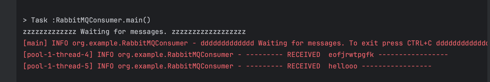
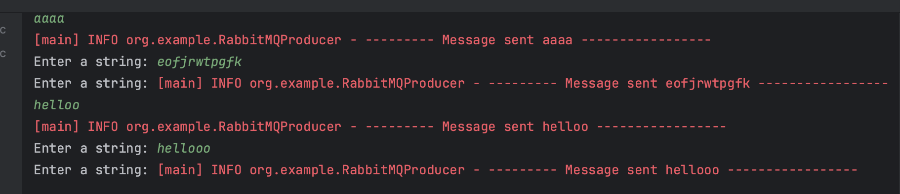
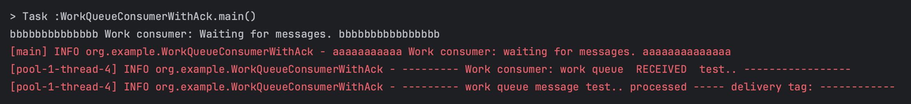
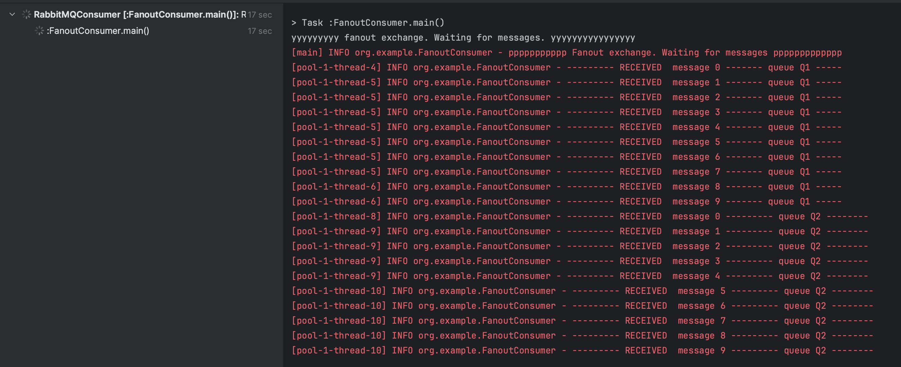
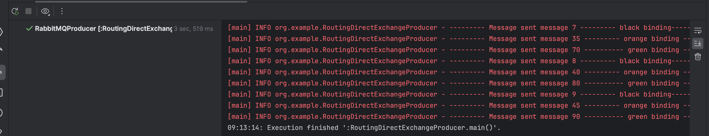
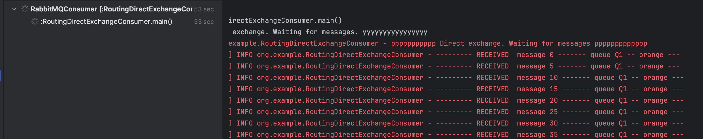
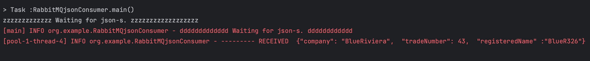
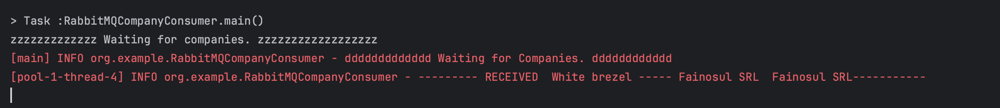

# Lab10

1. Install RabitMQ docker image
in a command line:

docker run -it --rm --name rabbitmq -p 5672:5672 -p 15672:15672 rabbitmq:3.12-management

2. Send data. Use your Producer API
RabbitMQProducer.java

3. Poll messages from queue.
RabbitMQConsumer.java
Launch multiple Consumers. Check how messages are round-robin dispatched between Consumers.

WorkQueueConsumer.java 
Consider scenario the message is proccesed after is received, by doWork(receivedMessage) method. 

4. WorkQueueConsumerWithAck.java
Auto acknoledgement channel.basicConsume(QUEUE_NAME, false,...)
Start 2 instances of the WorkQueueConsumerWithAck.java application.
Send messages that contains .. For each dot ., the application will sleep for 1 second.
For a message alpha..  will sleep for 2 seconds.
Send a message from the Producer. After message is received by the Consumer
" Work consumer: work queue  RECEIVED " , stop the Consumer.     
You should stop it until message "work queue  processed" appears. 
What happens? 
Sa sterg asta ---> mesajul este retransmis la al doilea Consumator si prelucrat <--  

5. Create next scenario: 1 Producer and 2 Consumers. 
All odd messages are heavy: Ex message ..........
All even messages are light: Ex message
Change dispatche order. Use  
int prefetchCount = 1;
channel.basicQos(prefetchCount);
on Producer side. 

6. Broadcast transmission using fanout exchange: pub/sub
FanoutProducer.java
FanoutConsumer.java
https://www.rabbitmq.com/tutorials/tutorial-three-java.html

7. Multiple queues, direct exchange: 
RoutingDirectExchangeProducer.java
RoutingDirectExchangeConsumer.java
https://www.rabbitmq.com/tutorials/tutorial-four-java.html

8. Send json file to exchange, using RabbitMQ.
RabbitMQJsonProducer.java
RabbitMQJsonConsumer.java

9. Send Company object to exchange, using RabbitMQ.
RabbitMQCompanyProducer.java
RabbitMQCompanyConsumer.java

