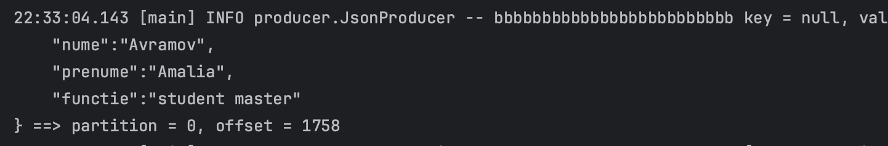
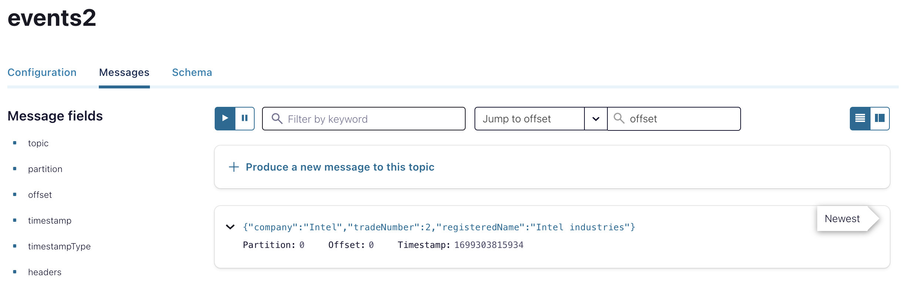
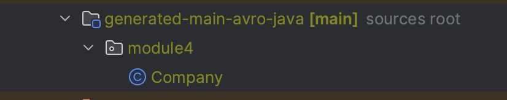
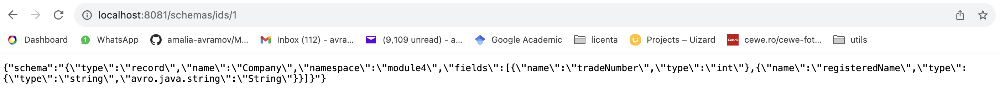
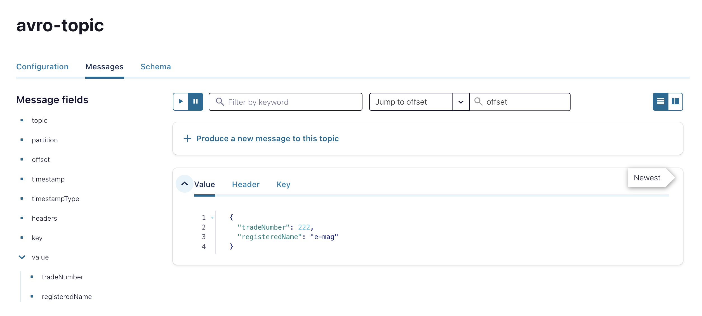

# Lab5: Kafka APIs: Producer-Consumer

1. Use SimpleExampleProducer.java class. Send an json file on topic events2. The modified file might be names JsonProducer.java. 

**The lab3 folder contains *JsonProducer.java* class.**



2. Use SimpleExampleProducer.java class or JsonProducer.java. 
Send a Java object as payload. 

The Java is the class 
public class Company {
    private String company;
    int tradeNumber;
    String registeredName;}
	
The file should be named CompanyProducer.java. 
In acest caz la dependencies se va adauga:    

```
implementation 'io.confluent:kafka-json-serializer:7.5.1'
```
```
repositories {
    maven {
        url "https://packages.confluent.io/maven"
    }
}
```

The files for this exercise can be found in the lab3 folder. 
To verify that the message has been sent I used **Control Center**.



3. Create a Producer that uses an avro schema for Company class.
In main folder of the Producer project create avro folder.
Copy file AvroCompany.avsc into avro folder. 

NOTE:  If you create the avro folder in any other folder, but NOT in main, the sources will NOT be generated. 
In build.gradle file:
Add   id 'com.github.davidmc24.gradle.plugin.avro' version '1.9.1'   at plugins section
Add   implementation group: 'io.confluent', name: 'kafka-avro-serializer', version: '7.5.1'   at dependencies section
Gradle tab --> Producer --> Tasks -->  source generation --> generateAvroJava
right click -> play "Run Producer"
The AvroCompany.java will be generated into "build" folder.
build --> generated-main-avro-java folder



verify schema-registry server:
http://localhost:8081/   --> the port coresponds with the value from docker-compose.yml
http://localhost:8081/subjects
http://localhost:8081/schemas/ids/1 



4. Create a Consumer that uses an avro schema for Company class.




### *Question: why is needed the class empty constructor?*

When sending or receiving objects on Kafka topics, serialization and deserialization are essential processes. During deserialization, an empty instance of the target object is created, and Kafka knows how to populate its fields based on the serialized data received from the topic. Having a default (empty) constructor is crucial for Kafka to create these instances during deserialization, allowing it to populate the fields with the data from the topic correctly.


