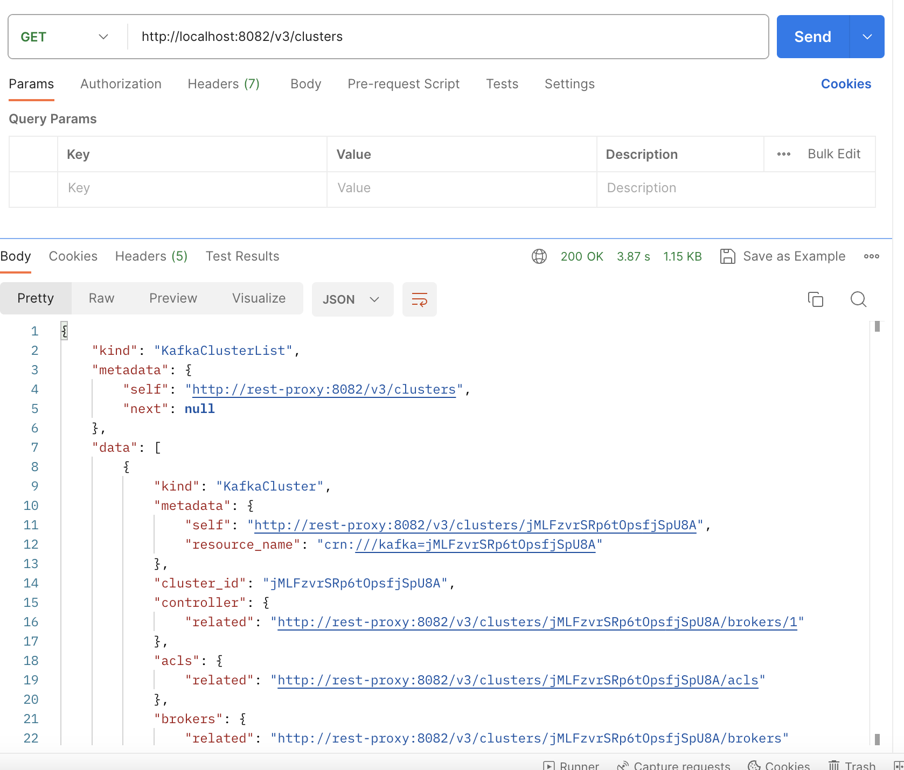
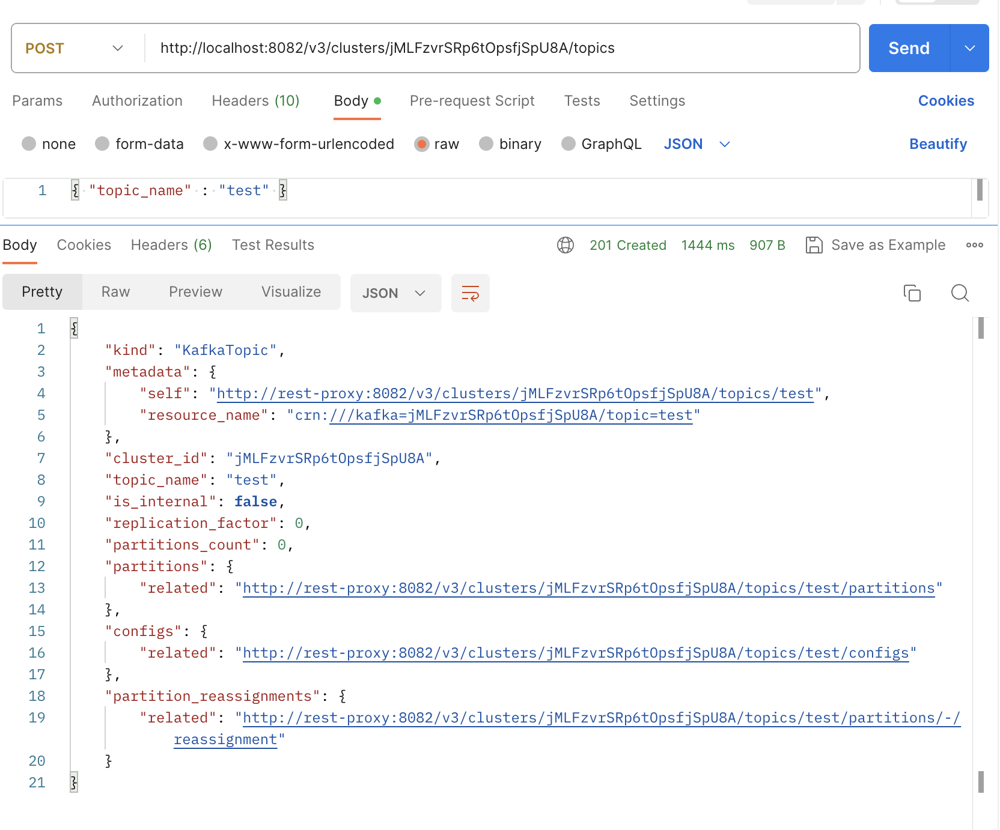
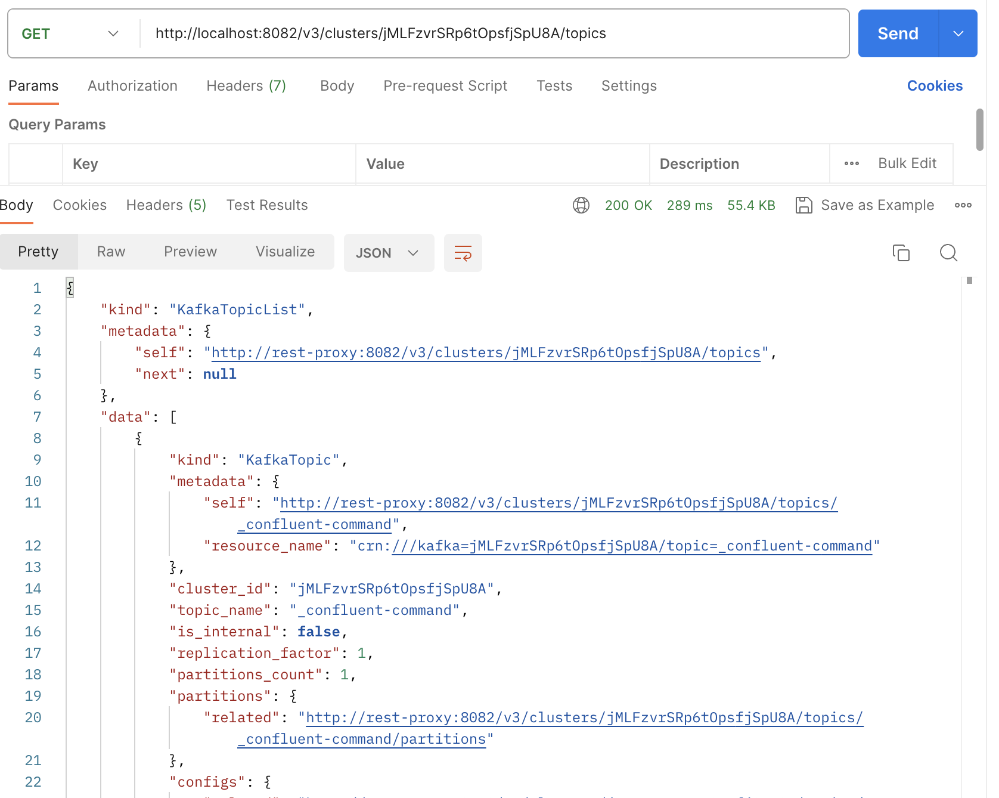
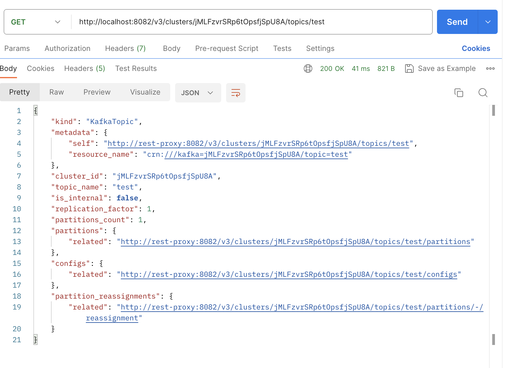
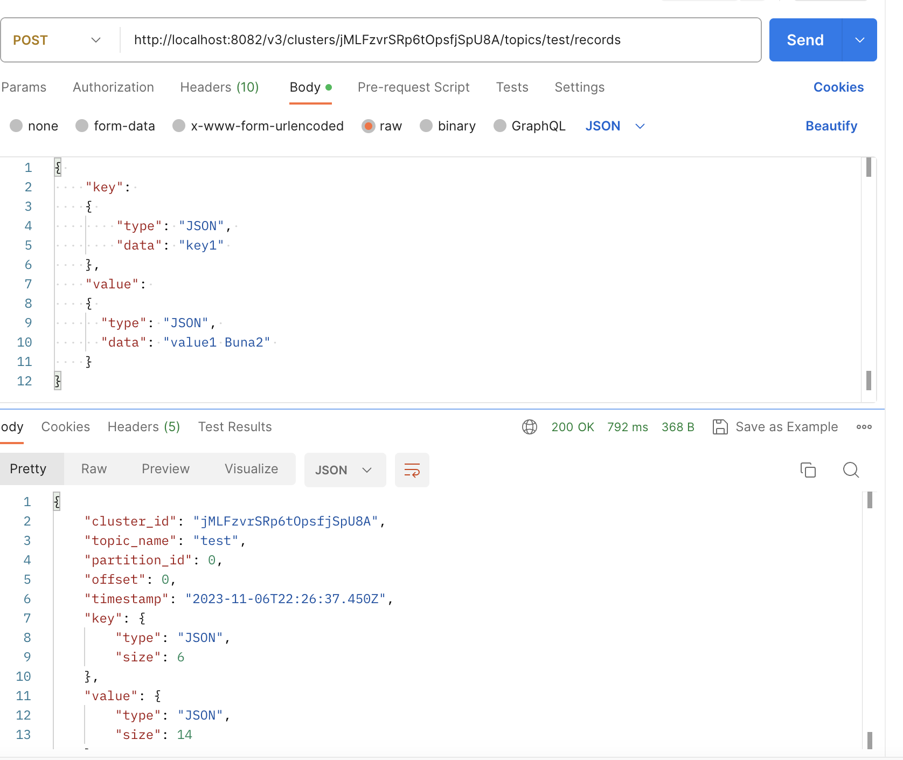
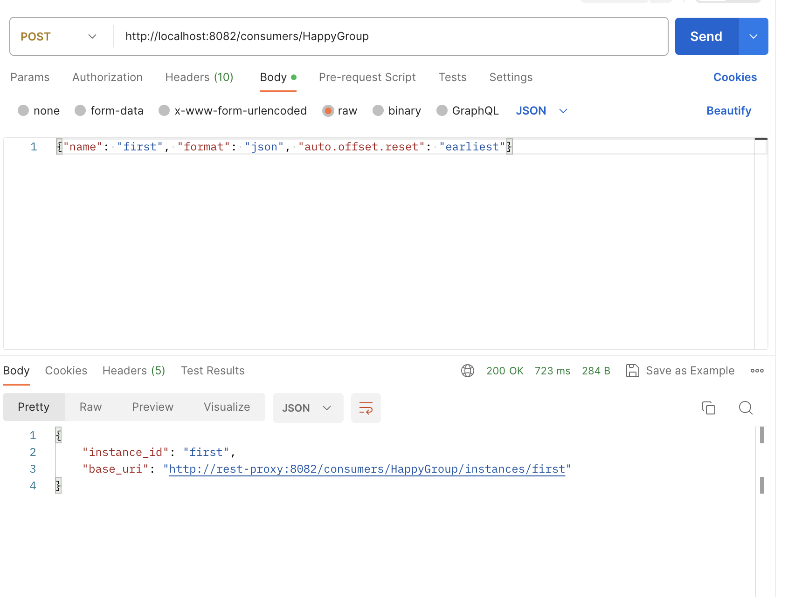
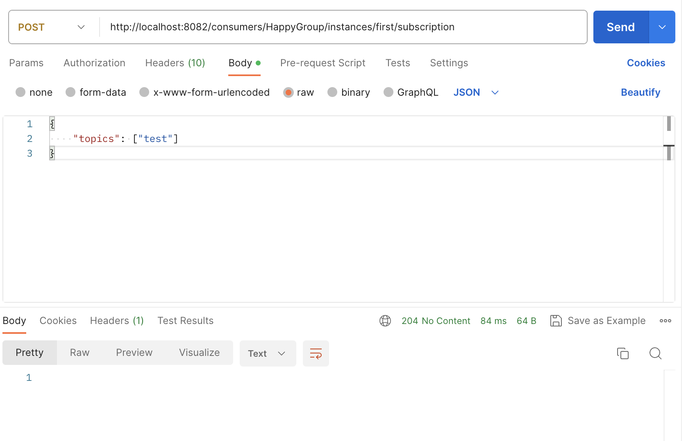
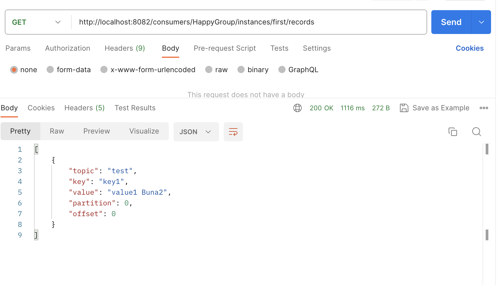
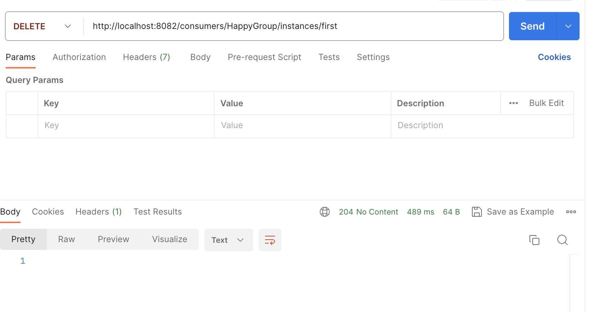

# Lab6: Postman commands

## 1. Get cluster Id

**GET** http://localhost:8082/v3/clusters

**Result:**

## 2. Set cluster id
 $cluster="TZ7rbN7FQbCOYoBBiK-oDg"
 $cluster="KDT0WZN5TVi-edeqC1QwWg"
 quwMo_QkQrqYvutHUCfPbw
 
## 3. Create topic
Body --> raw  --> JSON
{ "topic_name" : "postman_topic" }

Headers
key -->  Content-Type value --> application/json

**POST** http://localhost:8082/v3/clusters/$cluster/topics

**Result:**

## 4. List all topics: 
**GET** http://localhost:8082/v3/clusters/$cluster/topics

**Result:**

 
## 5. Describe topic

**GET**  http://localhost:8082/v3/clusters/$cluster/topics/postman_topic

**Result:**

## 6. Send data 
Body --> raw  --> JSON
{ "key": { "type": "JSON", "data": "key1" },
  "value": { "type": "JSON", "data": "value1 Buna" }
}

Headers
key -->  Content-Type value --> application/json
POST http://localhost:8082/v3/clusters/$cluster/topics/curl_topic/records

curl.exe -X POST -H "Content-Type: application/json" --data '{ \"key\": { \"type\": \"JSON\", \"data\": \"key1\" }, \"value\": { \"type\": \"JSON\", \"data\": \"value1 Buna\" } }' "http://localhost:8082/v3/clusters/$cluster/topics/curl_topic/records"

## 7. Create a consumer group

Body --> raw  --> JSON
{"name": "FirstConsumer", "format": "json", "auto.offset.reset": "earliest"}   

Headers
key -->  Content-Type value --> application/vnd.kafka.v2+json

POST http://localhost:8082/consumers/HappyGroup

curl.exe -X POST -H "Content-Type: application/vnd.kafka.v2+json"  --data '{\"name\": \"FirstConsumer\", \"format\": \"json\", \"auto.offset.reset\": \"earliest\"}'   http://localhost:8082/consumers/HappyGroup

{
    "instance_id": "FirstConsumer",
    "base_uri": "http://rest-proxy:8082/consumers/HappyGroup/instances/FirstConsumer"
}

## 8. Create subscription 
Body --> raw  --> JSON 
{"topics": ["postman_topic"]}

Headers
key -->  Content-Type value --> application/vnd.kafka.v2+json

POST http://localhost:8082/consumers/HappyGroup/instances/FirstConsumer/subscription

-- aici se poate adauga si o lista de topic-uri : {\"topics\": [\"topicFromPostman\", \"topic2\"]}
curl.exe -X POST -H "Content-Type: application/vnd.kafka.v2+json"  --data '{\"topics\": [\"topicFromPostman\"]}' http://localhost:8082/consumers/HappyGroup2/instances/FirstConsumer/subscription

## 9. Get messages
Headers
key -->  Content-Type value --> application/vnd.kafka.v2+json
key -->  Accept				--> application/vnd.kafka.json.v2+json
GET http://localhost:8082/consumers/HappyGroup/instances/FirstConsumer/records 

curl.exe -X GET  -H "Content-Type: application/vnd.kafka.json.v2+json" -H "Accept: application/vnd.kafka.json.v2+json"  "http://localhost:8082/consumers/HappyGroup/instances/FirstConsumer/records" 
curl.exe -X GET  -H "Content-Type: application/vnd.kafka.json.v2+json" -H "Accept: application/vnd.kafka.json.v2+json"  "http://localhost:8082/consumers/GrupConsumatori/instances/PrimulConsumer/records" 

## 10. Delete consumer group

curl.exe -X DELETE  -H "Content-Type: application/vnd.kafka.v2+json"  http://localhost:8082/consumers/GrupConsumatori/instances/PrimulConsumer

