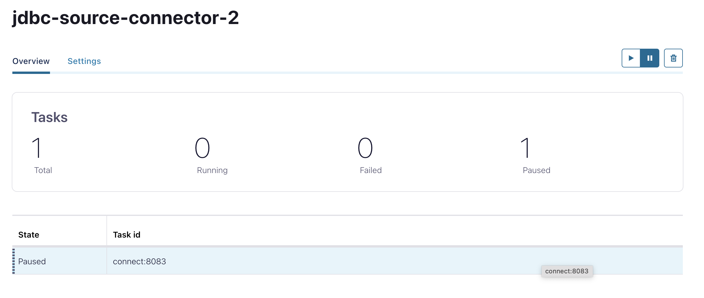

# Lab7: Kafka Terminology & Client APIs

### Part 1

 The steps from this exercise synchronise data from Postgres to Kafka and create a JDBC source connector. 

1. Login into  admin application http://localhost:8080

2. Login as

System: PostgreSQL
Server: postgres
Username: demo
Password: demo
Database: shop


2. Create a database (SQL command)

Press "SQL command" button from left side. 

CREATE TABLE IF NOT EXISTS products (
    id INT PRIMARY KEY,
    name VARCHAR(255),
    price INT
);


3. Enter SQL Command

  insert into products values(1, 'сup', 1);
  insert into products values(2, 'kettle', 5);
  insert into products values(3, 'phone', 500);
  insert into products values(4, 'tablet', 125);


4. Check connector-plugins through control center or through

curl http://localhost:8083/connector-plugins   from Windows PowerShell or MacOS shell
or @GET http://localhost:8083/connector-plugins  from  Postman

 
5. Add JDBC source connector

Add configuration through Control Center. 

http://localhost:9021

Connect Cluster -> connect-default -> Add connector -> JDBC Source Connector-> Upload connector config file. The configuration is in postgres-source-connector-1.json

or through REST

curl.exe -X POST -H 'Content-Type: application/json' -d @postgres-source-connector-1.json http://localhost:8083/connectors
Postman 

6. Check connectors through Control center or through REST

curl.exe http://localhost:8083/connectors/jdbc-source-connector/status


7. Check messages

http://localhost:8180/


8. Add more data 

  insert into products values(5, 'toaster', 15);
  insert into products values(6, 'coffee maker', 25);


9. Check messages

http://localhost:8180/


### Part 2

1. Add JDBC source connector

http://localhost:9021

Add configuration through Control Center. Connect -> Cluster -> JDBC Source Connector-> Upload connector config file. The configuration is in postgres-source-connector-2.json


or through REST

curl -X POST -H 'Content-Type: application/json' -d @postgres-source-connector-2.json http://localhost:8083/connectors


2. Stop connector 

curl.exe -X PUT localhost:8083/connectors/jdbc-source-connector/pause



3. Check status

curl.exe -X GET localhost:8083/connectors/jdbc-source-connector/status


4. Add new data (http://localhost:8080 login as demo|demo, use SQL Command)

  insert into products values(7, 'saucepan', 11);
  insert into products values(8, 'iron', 7);


5. Check messages

6. Resume connector 

curl.exe -X PUT localhost:8083/connectors/jdbc-source-connector/resume

7. Check status 

curl.exe -X GET localhost:8083/connectors/jdbc-source-connector/status


8. Check messages


### Part 3

1. In Control Center create JDBC sink connector. The configuration is in file postgres-sink-connector-1.json

http://localhost:9021


2. In schema registry container produce avro messages

```
/usr/bin/kafka-avro-console-producer --bootstrap-server kafka:19092 --topic customers  --property schema.registry.url=http://schema-registry:8081 --property value.schema="{\"type\":\"record\",\"name\":\"customer\",\"fields\":[{\"name\":\"id\",\"type\":\"int\"},{\"name\":\"name\",\"type\":\"string\"}]}"
```

{"id": 1, "name": "Jane Doe"}
{"id": 2, "name": "John Smith"}
{"id": 3, "name": "Ann Black"}


3. Check the table in http://localhost:8080


### Part 4

1. In Control Center create JDBC sink connector. The configuration is in file postgres-sink-connector-2.json

http://localhost:9021


2. In schema registry container produce avro messages
MERGE:

/usr/bin/kafka-avro-console-producer --bootstrap-server kafka:19092 --topic customers-with-key --property schema.registry.url=http://schema-registry:8081 --property value.schema="{\"type\":\"record\",\"name\":\"customer\",\"fields\":[{\"name\":\"id\",\"type\":\"int\"},{\"name\":\"name\",\"type\":\"string\"}]}"

-- fara \"  --> NU merge
docker exec -ti schema-registry /usr/bin/kafka-avro-console-producer --bootstrap-server kafka:19092 --topic customers-with-key --property schema.registry.url=http://schema-registry:8081 --property value.schema="{"type":"record","name":"customer","fields":[{"name":"id","type":"int"},{"name":"name","type":"string"}]}"


{"id": 1, "name": "Janett Falow"}
{"id": 2, "name": "John Cache"}
{"id": 3, "name": "Black Beauty"}


3. Check the table in http://localhost:8080


